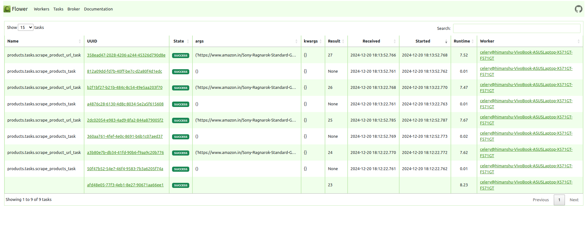

## Amazon Product Scraper
- Scheduled Amazon product scraper with django for backend using celery for doing background jobs

### Setup:
##### setting up redis, flower, prometheus as containers
```
$ sudo docker-compose up -d
```

##### check containers
```
$ sudo docker ps
```

#### starting server
```
$ python manage.py runserver
```

#### celery 
```
$ celery -A config worker --beat -l info
```

### Monitoring celery tasks using flower
localhost:5555


---
[](#) [](#) [](#) [](#) [](#) [](#)